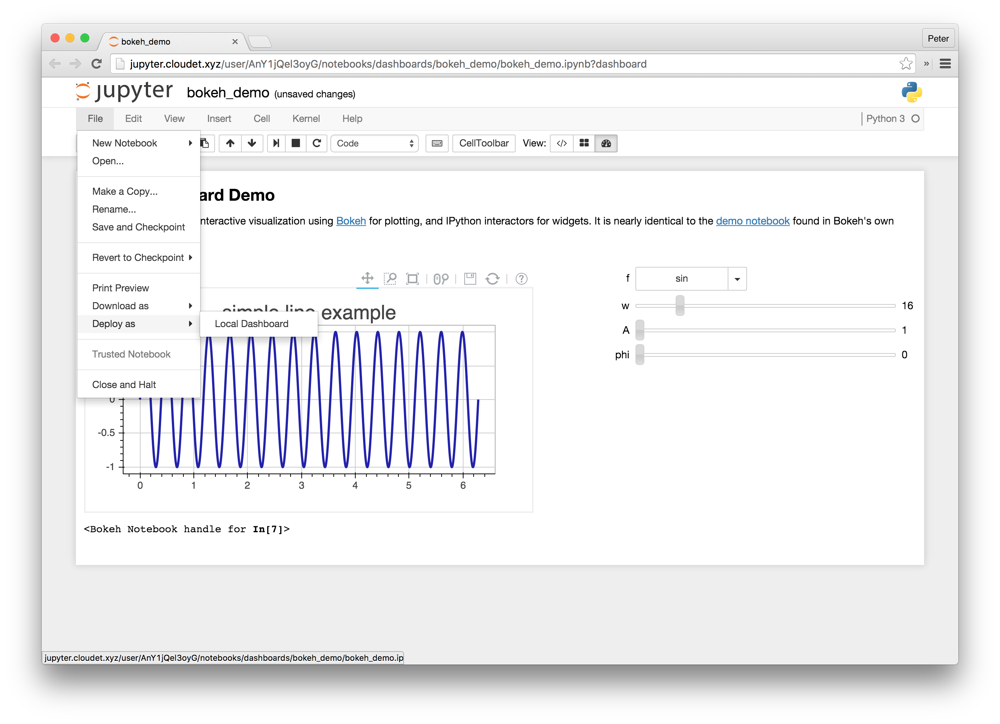

[](https://badge.fury.io/py/jupyter_dashboards_bundlers) [](https://groups.google.com/forum/#!forum/jupyter)

# Jupyter Dashboards Bundlers

Collection of reference implementation bundlers that convert, package, and deploy notebooks as standalone dashboards.



This repository is a portion of the `jupyter-incubator/dashboards` effort which covers:

* [Arranging](https://github.com/jupyter-incubator/dashboards) notebook outputs in a grid-layout
* [Bundling](https://github.com/jupyter-incubator/dashboards_bundlers) notebooks and associated assets for deployment as dashboards (**this repo**)
* [Serving](https://github.com/jupyter-incubator/dashboards_server) notebook-defined dashboards as standalone web apps

It is also has close ties to [jupyter-incubator/declarativewidgets](https://github.com/jupyter-incubator/declarativewidgets) which provides one way (but not the only way) of enabling rich interactivity in notebook-defined dashboards.

## What It Gives You

* *File &rarr; Download as &rarr; PHP Dashboard bundle (.zip)* menu item to download the current notebook as a PHP application using  [Thebe](https://github.com/oreillymedia/thebe) that you can deploy and configure.
* *File &rarr; Deploy as &rarr; Local dashboard* menu item to deploy the current notebook as a [Thebe](https://github.com/oreillymedia/thebe) application within the same Jupyter Notebook server instance.
* *File &rarr; Deploy as &rarr; Dashboard on Jupyter Dashboards Server* menu item to deploy the current notebook as a dashboard on a preconfigured [Jupyter Dashboards](https://github.com/jupyter-incubator/dashboards_nodejs_app) server.

## Prerequisites

* Jupyter Notebook 4.0.x running on Python 3.x or Python 2.7.x
* `jupyter_cms>=0.4.0`
* `jupyter_dashboards>=0.4.0`
* Edge, Chrome, Firefox, or Safari

## Install It

```bash
# install the python package
pip install jupyter_dashboards_bundlers
# enable the extension in your ~/.jupyter config
jupyter dashboards_bundlers activate
```

## Uninstall It

```bash
jupyter dashboards_bundlers deactivate
pip uninstall dashboards_bundlers
```

## Use It

Currently, there are three bundlers available in this package.

### Download &rarr; PHP Dashboard bundle (.zip)

The first converts your notebook to a PHP web application and zips it up with a Dockerfile and Cloud Foundry manifest. To use it:

1. Write a notebook.
2. Define a dashboard layout using the `jupyter_dashboards` extension.
3. Click *File &rarr; Download as &rarr; PHP Dashboard bundle (.zip)*.
4. Unzip the download.
5. Refer to the `README.md` in the unzipped folder for further instructions.

Note that the PHP application uses [Thebe](https://github.com/oreillymedia/thebe) which provides users with unfettered access to the backend kernel. Use it for public examples or in secure environments.

Ultimately, this option should go away as the [Jupyter Dashboard Server](https://github.com/jupyter-incubator/dashboards_server) matures. See the [dashboard deployment roadmap](https://github.com/jupyter-incubator/dashboards/wiki/Deployment-Roadmap) and [deployed dashboard threat analysis](https://github.com/jupyter-incubator/dashboards/wiki/Deployed-Dashboard-Threat-Analysis) for details.

### Deploy as &rarr; Local dashboard

The second bundler converts your notebook to a static HTML web application and deploys it to your Jupyter Notebook server for local use. To use it:

1. Write a notebook.
2. Define a dashboard layout using the `jupyter_dashboards` extension.
3. Click *File &rarr; Deploy as &rarr; Local Dashboard*.
4. Enjoy your dashboard after the redirect.

Note that the static HTML web application also uses [Thebe](https://github.com/oreillymedia/thebe) which provides unfettered access to a kernel in your notebook server. Use it for public examples or in secure environments.

Ultimately, this option should go away as the [Jupyter Dashboard Server](https://github.com/jupyter-incubator/dashboards_server) matures. See the [dashboard deployment roadmap](https://github.com/jupyter-incubator/dashboards/wiki/Deployment-Roadmap) and [deployed dashboard threat analysis](https://github.com/jupyter-incubator/dashboards/wiki/Deployed-Dashboard-Threat-Analysis) for details.

### Deploy as &rarr; Dashboard on Jupyter Dashboards Server

The third directly sends your notebook to a [Jupyter Dashboards Server](https://github.com/jupyter-incubator/dashboards_server). To use it:

0. Run an instance of the `jupyter_dashboards` server by following the instructions in the [jupyter-incubator/dashboards_server](https://github.com/jupyter-incubator/dashboards_server) project README.
1. Set the following environment variables before launching your Jupyter Notebook server with the bundler extensions installed.
    * `DASHBOARD_SERVER_URL` - protocol, hostname, and port of the dashboard server to which to send dashboard notebooks
    * `DASHBOARD_REDIRECT_URL` (optional) - protocol, hostname, and port to use when redirecting the user's browser after upload if different from `DASHBOARD_SERVER_URL`
    * `DASHBOARD_SERVER_AUTH_TOKEN` (optional) - upload token required by the dashboard server
2. Write a notebook.
3. Define a dashboard layout using the `jupyter_dashboards` extension.
4. Click *File &rarr; Deploy as &rarr; Dashboard on Jupyter Dashboard Server*.
5. Enjoy your dashboard after the redirect.

Note that the dashboard server does not use Thebe and takes steps to minimize user access to kernels to only those functions supported in the dashboard UI. However, while it is more secure than Thebe, it is still a work in progress and does not yet support all of the features of the other bundlers (e.g., deploying dashboards that use [declarative widgets](https://github.com/jupyter-incubator/declarativewidgets)).

Ultimately, this option should become the primary reference implementation of how to enable one-click deployment of notebooks as dashboards. See the [dashboard deployment roadmap](https://github.com/jupyter-incubator/dashboards/wiki/Deployment-Roadmap) and [deployed dashboard threat analysis](https://github.com/jupyter-incubator/dashboards/wiki/Deployed-Dashboard-Threat-Analysis) for details.

## Caveats

It is important to realize that kernels launched by your deployed dashboard will not being running in the same directory or possibly even the same environment as your original notebook. You must refer to external, kernel-side resources in a portable manner (e.g., put it in an external data store, use absolute file paths if your only concern is *File &rarr; Deploy as &rarr; Local Dashboard*). You must also ensure your kernel environment has all the same libraries installed as your notebook authoring environment.

It is also your responsibility to associate any frontend, dashboard-side assets with your notebook before packaging it for deployment. To aid in this task, the first two bundlers take advantage of the notebook association feature provided by the `jupyter_cms` package. See the [associations demo](https://github.com/jupyter-incubator/contentmanagement/) for the markup you can use to refer to external files that should be included in your dashboard deployment.

If you are using [declarative widgets](https://github.com/jupyter-incubator/declarativewidgets) in your dashboard, you should be mindful of the following when you deploy your dashboard:

* You must run the entire notebook successfully before deploying. This action ensures all external Polymer components are properly installed on the notebook server and can be bundled with your converted notebook.
* You cannot use `<urth-core-import>` elements in custom Polymer widgets that you develop outside your notebook. See [dashboards issue #78](https://github.com/jupyter-incubator/dashboards/issues/78) for the discussion and current workaround.
